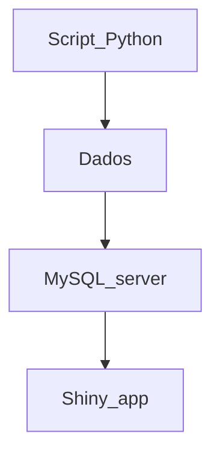

# VigiTrop
Projeto realizado nas disciplinas de Estágio Curricular I e II do curso de Biomedicina da Unifesp


#### O que é?
O VigiTrop é uma ferramenta que busca unir ferramentas de análise descritiva para 9 doenças tropicais negligenciadas. 

#### Como foi feito?
A interface foi construída na linguagem R, os dados foram baixados via Python e são armazenados em um servidor MySQL

#### Quais doenças são tratadas na aplicação?
Dengue, doença de Chagas, esquistossomose, envenenamento por picada de cobra, febre chikungunya, hanseníase, leishmaniose visceral, leishmaniose tegumentar americana e raiva humana.

Fluxograma da aplicação:




## Reprodutibilidade
Para a construção de gráficos no R, são necessários os conjuntos de dados com informações. Como maneira de se obter essas informações, em especial as de interesse do projeto, é necessário o download dos
microdados do Sinan. O Datasus oferece um sistema de donwload dos microdados, mas esse opera em software obsoleto. Como maneira de facilitar a obtenção dessa informação, utilizou-se o pacote PySUS, da linguagem
Python, que permite download de microdados do Sinan.

Suponhamos que se deseje obter os casos de raiva entre 2007 e 2024
```jupyter
pip install PySUS
import pysus
from pysus.online_data import SINAN
from pysus.ftp.databases.sinan import SINAN
sinan = SINAN().load()
import pandas as pd
import itertools
files = [sinan.get_files('RAIV', year) for year in range (2007, 2025)]
files_flat = list(itertools.chain.from_iterable(files))
data_dtn = sinan.download(files_flat)
import pandas as pd

#Criamos um DataFrame vazio para armazenar os dados finais
df_final = pd.DataFrame()

for i in range(0, len(files_flat)):
    print(f"Processando arquivo {i+1}/{len(files_flat)}...")  
    
    df_temp = data_dtn[i].to_dataframe()
    
    #Selecionamos apenas as colunas de interesse
    df_temp = df_temp[['NU_ANO', 'SG_UF', 'NU_IDADE_N', 'CS_SEXO', 'CS_RACA', 'CLASSI_FIN']]
    
    #Concatenamos o DataFrame temporário ao DataFrame final
    df_final = pd.concat([df_final, df_temp], ignore_index=True)
    
    #Excluímos o DataFrame temporário para liberar memória
    del df_temp
```

Após a seleção dos dados, surge uma etapa complexa, que requer acesso ao dicionário de dados de cada doença: a seleção dos casos suspeitos e confirmados e exclusão dos casos descartados, 
que muitas vezes são mantidos no banco. Em geral, a classificação final encontra-se na coluna 'CLASSI_FIN'

```jupyter
df_final['CLASSI_FIN'].value_counts()
```

Uma vez obtidos os valores de classificação final, precisa-se decidir quais serão mantidos. Para isso, necessita-se ler os dicionários das doenças. Em geral,
eles estão disponíveis no Datasus. A versão utilizada deles no presente projeto encontra-se na pasta 'Dicionários' deste repositório.
```jupyter
#Filtrando a classificação final
dados_filtrados = df_final[df_final['CLASSI_FIN'].isin(['1', '8'])]

```

Em seguida, criamos a variável 'idade_anos' a partir da coluna 'NU_IDADE_N'
```jupyter
from pysus.preprocessing.decoders import decodifica_idade_SINAN
# decodifica_idade_SINAN?

dados_filtrados['NU_IDADE_N'] = pd.to_numeric(dados_filtrados['NU_IDADE_N'], errors='coerce')
#Removemos as linhas onde 'NU_IDADE_N' contém NaN
dados_filtrados.dropna(subset=['NU_IDADE_N'], inplace=True)

#Aplicamos a função decodifica_idade_SINAN para criar a coluna 'idade_anos'
dados_filtrados['idade_anos'] = decodifica_idade_SINAN(dados_filtrados['NU_IDADE_N'], 'Y')

dados_filtrados['idade_anos'] = dados_filtrados['idade_anos'].fillna(0).astype(int)
```

Mudamos os valores das outras colunas a partir dos valores disponibilizados nos dicionários. Essa parte não necessariamente precisa ser feita neste momento. Como maneira de otimização, os dados
poderiam continuar com valores numéricos e serem inseridos no servidor MySQL, o que facilitaria consultas. A tradução poderia ocorrer posteriormente, otimizando o processo. Criamos, também, a coluna 
faixa_etaria
```jupyter
dados_filtrados['NU_ANO'] = dados_filtrados['NU_ANO'].astype(int)
dados_filtrados['idade_anos'] = dados_filtrados['idade_anos'].astype(int)
dados_filtrados['CS_SEXO'] = dados_filtrados['CS_SEXO'].replace(['F', 'M', 'I', ' '], ['Feminino', 'Masculino', 'Ignorado', 'Ignorado'])
dados_filtrados['CS_RACA'] = dados_filtrados['CS_RACA'].replace(['1', '2', '3', '4', '5', '9'], ['Branca', 'Preta', 'Amarela', 'Parda', 'Indígena', 'Ignorado'])
dados_filtrados['SG_UF'] = dados_filtrados['SG_UF'].replace(['0', '99', '11', '12', '13', '14', '15', '16', '17', '21', '22', '23', '24', '25', '26', '27', '28', '29', '31', '32', '33', '35', '41', '42', '43', '50', '51', '52', '53', '  '], ['Ignorado', 'Ignorado', 'Rondônia', 'Acre', 'Amazonas', 'Roraima', 'Pará', 'Amapá', 'Tocantins', 'Maranhão', 'Piauí', 'Ceará', 'Rio Grande do Norte', 'Paraíba', 'Pernambuco', 'Alagoas', 'Sergipe', 'Bahia', 'Minas Gerais', 'Espírito Santo', 'Rio de Janeiro', 'São Paulo', 'Paraná', 'Santa Catarina', 'Rio Grande do Sul', 'Mato Grosso do Sul', 'Mato Grosso', 'Goiás', 'Distrito Federal', 'Ignorado'])

bins = [0, 4, 9, 14, 19, 24, 29, 34, 39, 44, 49, 54, 59, 64, 69, 74, 79, 84, 89, 120]  # Faixas de idade
labels = ['0-4', '5-9', '10-14', '15-19', '20-24', '25-29', '30-34', '35-39', '40-44', '45-49', '50-54', '55-59', '60-64', '65-69', '70-74', '75-79', '80-84', '85-89', '>=90']

#Criando a nova coluna 'faixa_etaria' com pd.cut()
dados_filtrados['faixa_etaria'] = pd.cut(dados_filtrados['idade_anos'], bins=bins, labels=labels, right=False)
dados_filtrados['idade_anos'] = dados_filtrados['idade_anos'].fillna(0).astype(int)
```

Obtemos, por fim, os dados em .csv
```jupyter
dados_filtrados.to_csv('casos_raiva_2007_2024.csv', index = False)
```


Após a obtenção dos arquivos .csv de todas as doenças, criamos um servidor MySQL (ou qualquer outro que armazene um banco de dados) e enviamos os dados para esse servidor. Durante
a etapa de elaboração dos bancos de dados, existem inúmeras maneiras de otimizar consultas e, assim, dimimuir o tempo necessário. No projeto, no entanto, não realizamos quaisquer otimizações.
No futuro, espera-se que tornemos o banco de dados utilizado mais otimizado.

Após a criação do banco de dados, criamos o aplicativo em Shiny que se conectará via biblioteca 'RMySQL' ao servidor MySQL e exibirá os gráficos e análises selecionadas pelo usuário.

###Comentários
O projeto encontra-se em estágio inicial de desenvolvimento. Reconheço que muitos processos podem ser otimizados, facilitados e simplificados e me coloco à disposição para eventuais comentários, críticas ou sugestões através do email gabriel.graciano@unifesp.br
