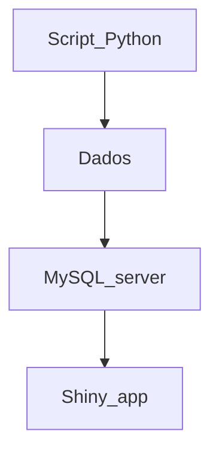

# VigiTrop
Projeto realizado nas disciplinas de Estágio Curricular I e II do curso de Biomedicina da Unifesp


#### O que é?
O VigiTrop é uma ferramenta que busca unir ferramentas de análise descritiva para 9 doenças tropicais negligenciadas. 

#### Como foi feito?
A interface foi construída na linguagem R, os dados foram baixados via Python e são armazenados em um servidor MySQL

#### Quais doenças são tratadas na aplicação?
Dengue, doença de Chagas, esquistossomose, envenenamento por picada de cobra, febre chikungunya, hanseníase, leishmaniose visceral, leishmaniose tegumentar americana e raiva humana.

Fluxograma da aplicação:




## Reprodutibilidade
Para a construção de gráficos no R, são necessários os conjuntos de dados com informações. Como maneira de se obter essas informações, em especial as de interesse do projeto, é necessário o download dos
microdados do Sinan. O Datasus oferece um sistema de donwload dos microdados, mas esse opera em software obsoleto. Como maneira de facilitar a obtenção dessa informação, utilizou-se o pacote PySUS, da linguagem
Python, que permite download de microdados do Sinan.
```jupyter
pip install PySUS
import pysus
from pysus.online_data import SINAN
from pysus.ftp.databases.sinan import SINAN
sinan = SINAN().load()
sinan.diseases #esse comando irá nos fornecer as doenças listadas no Sinan
```
Suponhamos que se deseje obter os casos de raiva entre 2010 e 2024

```jupyter
from pysus.online_data import SINAN

#Primeiro, definimos o intervalo de tempo
anos = range(2010, 2025)

#Iteramos os arquivos, baixando-os
for ano in anos:
    globals()[f'raiv_{ano}'] = sinan.get_files('RAIV', ano)  # Baixar os arquivos ESQU
    globals()[f'raiv_{ano}'] = sinan.download(globals()[f'raiv_{ano}'])  # Fazer o download

import pandas as pd

#Armazenamos os arquivos em un dicionário
dados_raiv = {}

#Iteramos pelos anos e lemos os arquivos .parquet
for ano in anos:
    nome_arquivo = f'/home/gabrielgraciano/pysus/RAIVBR{str(ano)[-2:]}.parquet' 
    dados_raiv[ano] = pd.read_parquet(nome_arquivo)

#Verificamos se foi bem sucedido
print(dados_raiv[2012].head())

```

Após a seleção dos dados, surge uma etapa complexa, que requer acesso ao dicionário de dados de cada doença: a seleção dos casos suspeitos e confirmados e exclusão dos casos descartados, 
que muitas vezes são mantidos no banco

```jupyter
#Em geral, a classificação final está na coluna 'CLASSI_FIN'
for ano in anos:
    if ano in dados_raiv:  
        if 'CLASSI_FIN' in dados_raiv[ano].columns:  #Verifica se a coluna existe
            valores_unicos = dados_raiv[ano]['CLASSI_FIN'].unique()
            print(f"Ano: {ano}, Valores únicos de 'CLASSI_FIN': {valores_unicos}")
        else:
            print(f"Ano: {ano}, 'CLASSI_FIN' não encontrada. Colunas disponíveis: {dados_raiv[ano].columns}")
    else:
        print(f"Dados do ano {ano} não estão disponíveis.")
#Assim, conseguimos obter os valores de classificação final
```
Uma vez obtidos os valores de classificação final, precisa-se decidir quais serão descartados. Para isso, necessita-se ler os dicionários das doenças. Em geral,
eles estão disponíveis no Datasus. A versão utilizada deles no presente projeto encontra-se na pasta 'Dicionários' deste repositório.

```jupyter

#Armazenamento dos DataFrames lidos em uma lista para unificação
df_list = []

#Iteramos pelos anos e unificamos os DataFrames
for ano in anos:
    if ano in dados_raiv:  
        df_list.append(dados_raiv[ano])  #Adiciona o DataFrame do ano na lista
    else:
        print(f"Dados do ano {ano} não estão disponíveis.")

#Concatenamos todos os DataFrames em um único DataFrame
df_unificado = pd.concat(df_list, ignore_index=True)

#Removemos as entradas onde 'CLASSI_FIN' == 2. Esse é um caso específico para a raiva. Esse número varia de doença para doença e necessita ser verificado no dicionário

df_filtrado = df_unificado[df_unificado['CLASSI_FIN'] != '2']

print(df_filtrado['CLASSI_FIN'].unique())
```

Em seguida, necessita-se decodificar a idade
```
from pysus.preprocessing.decoders import decodifica_idade_SINAN
df_filtrado['NU_IDADE_N'] = pd.to_numeric(df_filtrado['NU_IDADE_N'], errors = 'coerce')

# Step 2: Calcular a mediana, ignorando valores NaN
median_age = df_filtrado['NU_IDADE_N'].median()

# Step 3: Substituir os valores NaN pela mediana
df_filtrado['NU_IDADE_N'].fillna(median_age, inplace=True)

# Step 4: Opcional - Converter para inteiros, se necessário
# df_concatenado['NU_IDADE_N'] = df_concatenado['NU_IDADE_N'].astype(int)

# Verificar o resultado
print(df_filtrado['NU_IDADE_N'].unique())
```
