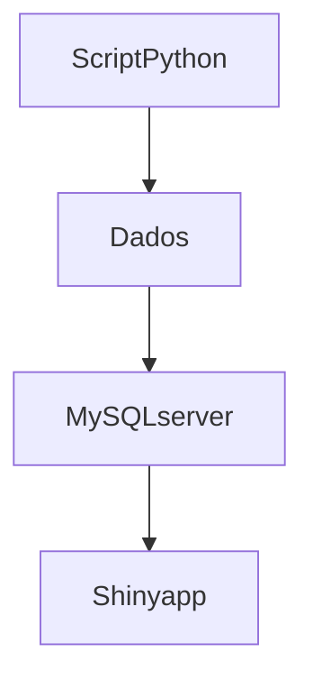

# VigiTrop
Projeto realizado nas disciplinas de Estágio Curricular I e II do curso de Biomedicina da Unifesp


#### O que é?
O VigiTrop é uma ferramenta que busca unir ferramentas de análise descritiva para 9 doenças tropicais negligenciadas. 

#### Como foi feito?
A interface foi construída na linguagem R, os dados foram baixados via Python e são armazenados em um servidor MySQL

#### Quais doenças são tratadas na aplicação?
Dengue, doença de Chagas, esquistossomose, envenenamento por picada de cobra, febre chikungunya, hanseníase, leishmaniose visceral, leishmaniose tegumentar americana e raiva humana.

Fluxograma da aplicação:




## Reprodutibilidade
Para a construção de gráficos no R, são necessários os conjuntos de dados com informações. Como maneira de se obter essas informações, em especial as de interesse do projeto, é necessário o download dos
microdados do Sinan. O Datasus oferece um sistema de donwload dos microdados, mas esse opera em software obsoleto. Como maneira de facilitar a obtenção dessa informação, utilizou-se o pacote PySUS, da linguagem
Python, que permite download de microdados do Sinan.
```
pip install PySUS
import pysus
from pysus.online_data import SINAN
from pysus.ftp.databases.sinan import SINAN
sinan = SINAN().load()
sinan.diseases #esse comando irá nos fornecer as doenças listadas no Sinan
```


